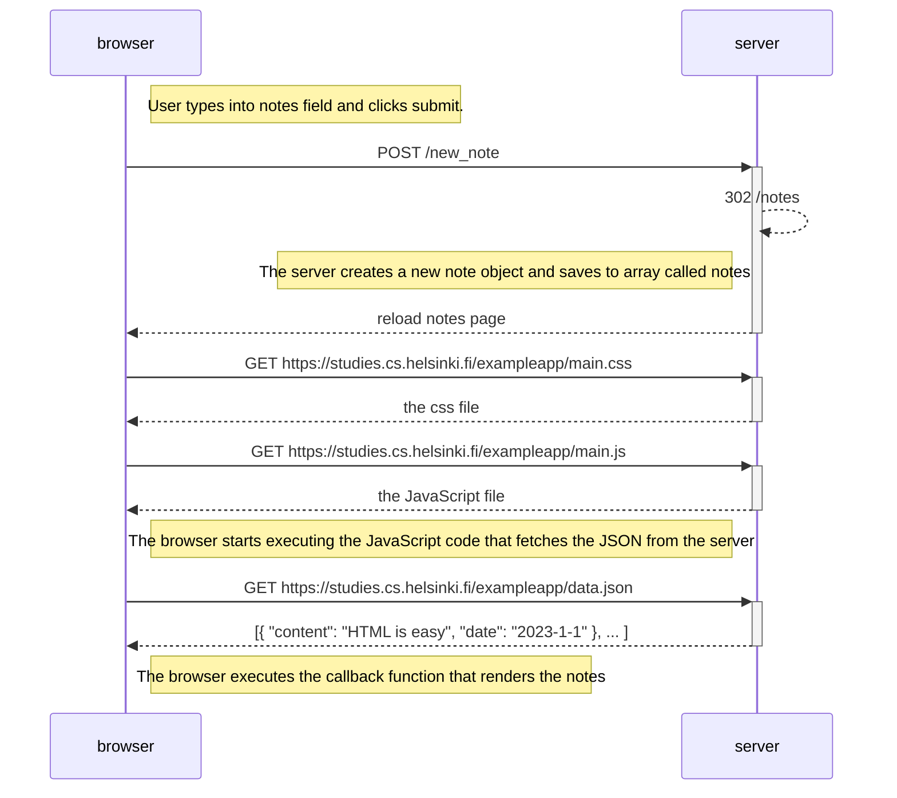

```mermaid
sequenceDiagram
    participant browser
    participant server

    Note right of browser: User types into notes field and clicks submit.

    browser->>+server: POST /new_note
    server-->>server: 302 /notes

    Note left of server: The server creates a new note object and saves to array called notes

    server-->>-browser: reload notes page

    browser->>+server: GET https://studies.cs.helsinki.fi/exampleapp/main.css
    server-->>-browser: the css file

    browser->>+server: GET https://studies.cs.helsinki.fi/exampleapp/main.js
    server-->>-browser: the JavaScript file

    Note right of browser: The browser starts executing the JavaScript code that fetches the JSON from the server

    browser->>+server: GET https://studies.cs.helsinki.fi/exampleapp/data.json
    server-->>-browser: [{ "content": "HTML is easy", "date": "2023-1-1" }, ... ]

    Note right of browser: The browser executes the callback function that renders the notes
```